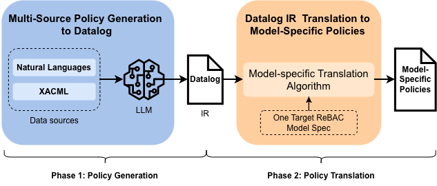

# ReBAC-Project-Code-Python
> A Datalog-Based workflow for Generating and Translating Relationship-Based Access Control Policies.

## Overview
This project implements a Datalog-Based workflow for generating and translating Relationship-Based Access Control (ReBAC) policies. The workflow consists of two main phases:
- Phase 1: Policy Generation: Generating ReBAC policies in Datalog format from natural language statements and xacml specifications by using LLM.
- Phase 2: Policy Translation: Translating policies from Datalog format to the four representative ReBAC models' specific policies.

## Policy Generation

## Policy Translation
> Coming soon...