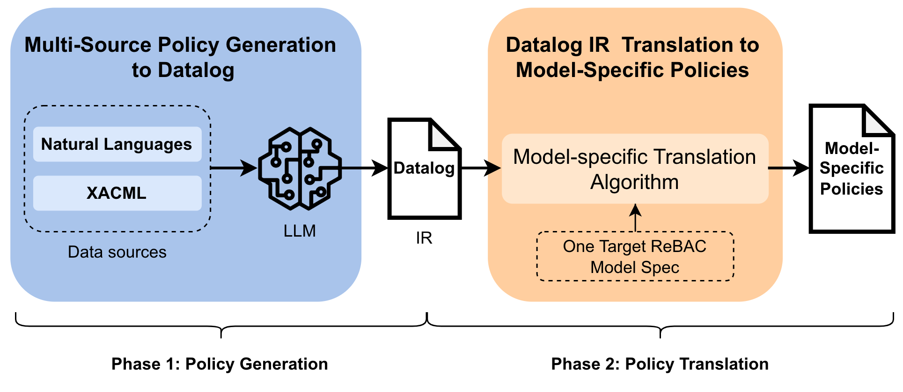
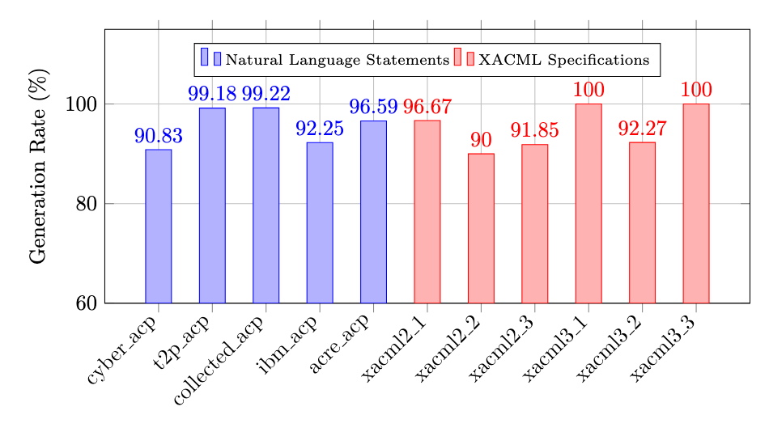
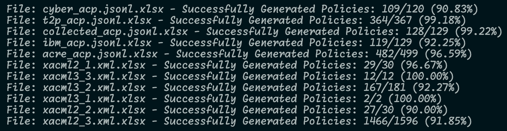

# ReBAC-Project-Code-Python
> A Datalog-Based workflow for Generating and Translating Relationship-Based Access Control Policies.

## Overview
This project implements a Datalog-Based workflow for generating and translating Relationship-Based Access Control (ReBAC) policies. The workflow consists of two main phases:
- Phase 1: Policy Generation: Generating ReBAC policies in Datalog format from natural language statements and xacml specifications by using LLM.
- Phase 2: Policy Translation: Translating policies from Datalog format to the four representative ReBAC models' specific policies.

[](imgs/workflow_dpi300.png)

## Policy Generation

[](imgs/gen_rate.png)

[](imgs/eval_policy_gen.png)

## Policy Translation

### Target ReBAC Models:

1. Carminati et al.'s ReBAC Model
2. Fong et al.'s ReBAC Model
3. Cheng et al.'s ReBAC Model
4. Crampton et al.'s ReBAC Model

### Algorithm 1: Translation to Carminati et al.'s ReBAC Model
> Coming soon...

### Algorithm 2: Translation to Fong et al.'s ReBAC Model
> Coming soon...

### Algorithm 3: Translation to Cheng et al.'s ReBAC Model
> Coming soon...

### Algorithm 4: Translation to Crampton et al.'s ReBAC Model
> Coming soon...

## Citations

The four ReBAC models targeted in this project are based on the following papers. 

1. Carminati et al.'s:
```bibtex
@inproceedings{10.1145/1542207.1542237,
    author = {Carminati, Barbara and Ferrari, Elena and Heatherly, Raymond and Kantarcioglu, Murat and Thuraisingham, Bhavani},
    title = {A semantic web based framework for social network access control},
    year = {2009},
    isbn = {9781605585376},
    publisher = {Association for Computing Machinery},
    address = {New York, NY, USA},
    url = {https://doi.org/10.1145/1542207.1542237},
    doi = {10.1145/1542207.1542237},
}
```
2. Fong et al.'s:
```bibtex
@inproceedings{10.1145/1943513.1943539,
    author = {Fong, Philip W.L.},
    title = {Relationship-based access control: protection model and policy language},
    year = {2011},
    isbn = {9781450304665},
    publisher = {Association for Computing Machinery},
    address = {New York, NY, USA},
    url = {https://doi.org/10.1145/1943513.1943539},
    doi = {10.1145/1943513.1943539},
    booktitle = {Proceedings of the First ACM Conference on Data and Application Security and Privacy},
    pages = {191–202},
    numpages = {12},
    keywords = {social networks, relationship-based access control, policy language, modal logic, electronic health records, contexts},
    location = {San Antonio, TX, USA},
    series = {CODASPY '11}
}
```

3. Cheng et al.'s:
```bibtex
@InProceedings{10.1007/978-3-642-31540-4_2,
    author="Cheng, Yuan
    and Park, Jaehong
    and Sandhu, Ravi",
    editor="Cuppens-Boulahia, Nora
    and Cuppens, Fr{\'e}d{\'e}ric
    and Garcia-Alfaro, Joaquin",
    title="A User-to-User Relationship-Based Access Control Model for Online Social Networks",
    booktitle="Data and Applications Security and Privacy XXVI",
    year="2012",
    publisher="Springer Berlin Heidelberg",
    address="Berlin, Heidelberg",
    pages="8--24",
    isbn="978-3-642-31540-4"
}

```
4. Crampton et al.'s:
```bibtex
@inproceedings{10.1145/2613087.2613094,
    author = {Crampton, Jason and Sellwood, James},
    title = {Path conditions and principal matching: a new approach to access control},
    year = {2014},
    isbn = {9781450329392},
    publisher = {Association for Computing Machinery},
    address = {New York, NY, USA},
    url = {https://doi.org/10.1145/2613087.2613094},
    doi = {10.1145/2613087.2613094},
    booktitle = {Proceedings of the 19th ACM Symposium on Access Control Models and Technologies},
    pages = {187–198},
    numpages = {12},
    keywords = {access control, authorization, path condition, principal matching, relationship},
    location = {London, Ontario, Canada},
    series = {SACMAT '14}
}
```